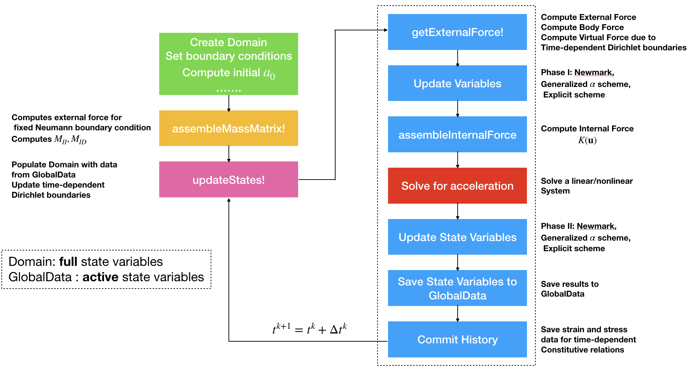

# Simulaton Code Structure  

We use the Newmark method or the generalized $\alpha$ scheme to solve the dynamics equation numerically. 

$$m\ddot{ \mathbf{u}} + \gamma\dot{\mathbf{u}} + k\mathbf{u} = \mathbf{f}$$

The discretized form is 

$$M\mathbf{a} + C\mathbf v + K \mathbf d = \mathbf F$$

For a detailed description of the generalized $\alpha$ scheme, see [this post](https://kailaix.github.io/ADCME.jl/dev/alphascheme/). 


NNFEM.jl supports two types of boundary conditions, the Dirichlet boundary condition and the Neumann boundary condition. Both boundary conditions can be time independent or dependent. Read [] for how to specify time dependent boundary conditions and [] for how to specify time independent boundary conditions. 


Here is a script for simulation using an explicit solver. 
```julia
NT = 100
Δt = 1.0e-2
T = NT * Δt

m, n =  20, 10
h = 0.1

# Create a very simple mesh
elements = SmallStrainContinuum[]
prop = Dict("name"=> "PlaneStrain", "rho"=> 0.0876584, "E"=>0.07180760098, "nu"=>0.4)
coords = zeros((m+1)*(n+1), 2)
for j = 1:n
    for i = 1:m
        idx = (m+1)*(j-1)+i 
        elnodes = [idx; idx+1; idx+1+m+1; idx+m+1]
        ngp = 3
        nodes = [
            (i-1)*h (j-1)*h
            i*h (j-1)*h
            i*h j*h
            (i-1)*h j*h
        ]
        coords[elnodes, :] = nodes
        push!(elements, SmallStrainContinuum(nodes, elnodes, prop, ngp))
    end
end

# fixed on the bottom, push on the right
EBC = zeros(Int64, (m+1)*(n+1), 2)
FBC = zeros(Int64, (m+1)*(n+1), 2)
g = zeros((m+1)*(n+1), 2)
f = zeros((m+1)*(n+1), 2)
for i = 1:m+1
    for j = 1:n+1
        idx = (j-1)*(m+1) + i 
        if j==n+1
            EBC[idx,:] .= -1
        end
        if i==m+1 && j!=n+1
            FBC[idx,1] = -1
            f[idx,1] = -0.001
        end
    end
end
ndims = 2
domain = Domain(coords, elements, ndims, EBC, g, FBC, f)


Dstate = zeros(domain.neqs)
state = zeros(domain.neqs)
velo = zeros(domain.neqs)
acce = zeros(domain.neqs)
gt = nothing
ft = nothing
globdat = GlobalData(state, Dstate, velo, acce, domain.neqs, gt, ft)


assembleMassMatrix!(globdat, domain)
updateStates!(domain, globdat)

for i = 1:NT
@info i 
    global globdat, domain = ExplicitSolverStep(globdat, domain, Δt)
end
visualize_displacement(domain)
visualize_von_mises_stress(domain)
```

The explicit solver is implemented as follows

```julia
function ExplicitSolverStep(globdat::GlobalData, domain::Domain, Δt::Float64)
    u = globdat.state[:]
    ∂u  = globdat.velo[:]
    ∂∂u = globdat.acce[:]

    fext = getExternalForce!(domain, globdat)

    u += Δt*∂u + 0.5*Δt*Δt*∂∂u
    ∂u += 0.5*Δt * ∂∂u
    
    domain.state[domain.eq_to_dof] = u[:]
    fint  = assembleInternalForce( globdat, domain, Δt)
    ∂∂up = globdat.M\(fext - fint)

    ∂u += 0.5 * Δt * ∂∂up

    globdat.Dstate = globdat.state[:]
    globdat.state = u[:]
    globdat.velo = ∂u[:]
    globdat.acce = ∂∂up[:]
    globdat.time  += Δt
    commitHistory(domain)
    updateStates!(domain, globdat)

    return globdat, domain
end
```

We show the follow chart of the implementation. Note inside the `ExplicitSolverStep` function, the data is exchanged between `globdat` and `domain`. In general, `globdat` saves only the active components of the degrees of freedom (excluding Dirichlet boundary nodes) while `domain` maintains the full information. 




## Updating the Boundary Conditions

We give a short description on how the boundary conditions are tackled in NNFEM. In general, we have two kinds of boundary conditions; namely, they are **Dirichlet boundary conditions** (also known as **essential boundary conditions**) and **Neumann boundary conditions** (also known as **natural boundary conditions**). They can be both time dependent or time independent. 

### Dirichlet Boundary Conditions

The basic idea for tackling Dirichlet boundary conditions is to trim the coefficient matrices $M$ and $K$, and update the right hand side force vectors (consider a linear problem)

$$M \ddot \mathbf{u} + K \mathbf{u} = \mathbf{f}$$

We have

$$M_{II} {\ddot \mathbf{u}}_I + M_{ID} \ddot \mathbf{u}_D + K_{I:} \mathbf{u} = \mathbf{f}$$

Here $I$ stands for the active DOF, and $D$ stands for **time-dependent** Dirichlet boundary condition DOF. Note $\ddot\mathbf{u} = \mathbf{0}$ for time-independent Dirichlet nodes. 

[`assembleMassMatrix!`](@ref) computes and stores `M_{II}` and `M_{ID}` in [`GlobalData`](@ref). In the time stepping, when [`getExternalForce!`](@ref) is called, $M_{ID} \ddot \mathbf{u}_D$ is computed and substracted from right hand side. 

For the stiffness matrix $K_{I:} \mathbf{u}$, in every iteration, given a candidate $\mathbf{u}$, [`assembleStiffAndForce`](@ref) computes 

$$K_{II}, K_{I:} \mathbf{u}$$

This information is sufficient to solve for $\ddot \mathbf{u}$ or $\mathbf{u}$. 