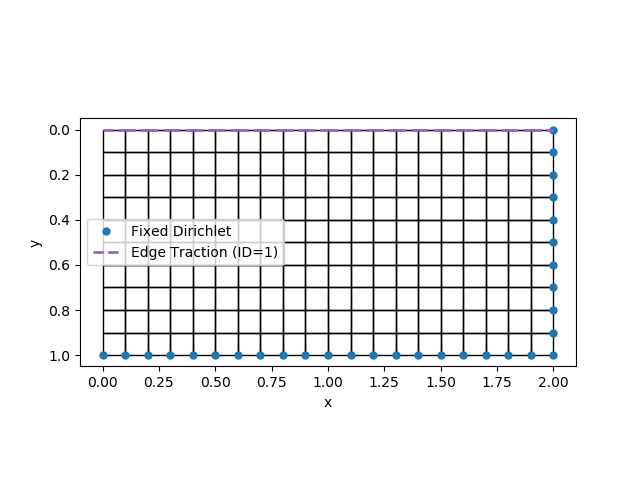
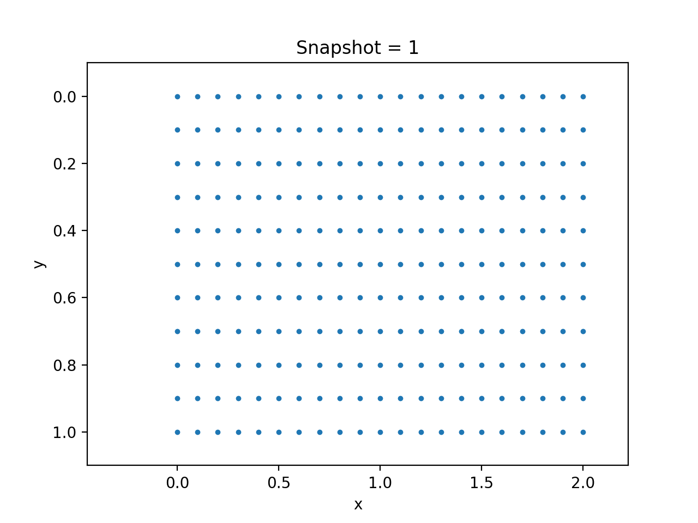
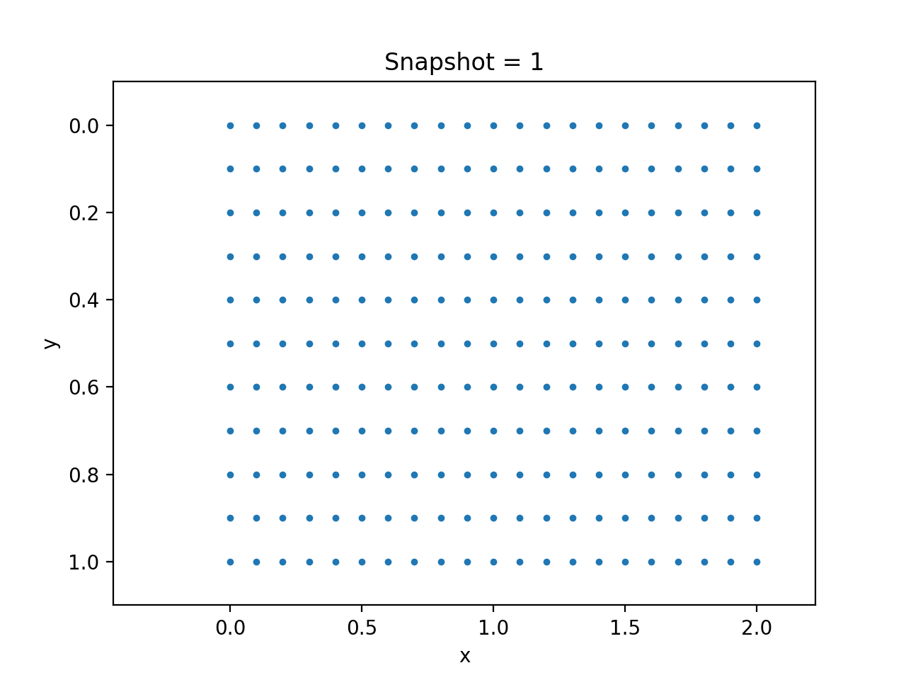

# Hyperelasticity

In this section, we consider the simulation of hyperelasticity material. We use the following settings:

* The constitutive relation is given by the plane stress incompressible Rivlin Saunders model. 

* We use finite strain for numerical discretization. 

* We fix the right and bottom side of a plate, and impose verticle pressure from the top. The left side is subject to traction-free boundary condition. 

  

The follows shows the simulation code

```julia
using Revise
using NNFEM 
using PyPlot
using LinearAlgebra
using ADCME
using ADCMEKit

NT = 100
Δt = 1/NT 

n = 10
m = 2n 
h = 1/n

# Create a very simple mesh
elements = FiniteStrainContinuum[]
prop = Dict("name"=> "PlaneStressIncompressibleRivlinSaunders", "rho"=> 1.0,  "C1"=>1e-3, "C2"=>1e-1)
coords = zeros((m+1)*(n+1), 2)
for j = 1:n
    for i = 1:m
        idx = (m+1)*(j-1)+i 
        elnodes = [idx; idx+1; idx+1+m+1; idx+m+1]
        ngp = 3
        nodes = [
            (i-1)*h (j-1)*h
            i*h (j-1)*h
            i*h j*h
            (i-1)*h j*h
        ]
        coords[elnodes, :] = nodes
        push!(elements, FiniteStrainContinuum(nodes, elnodes, prop, ngp))
    end
end

# impose force on the top
Edge_Traction_Data = Array{Int64}[]
for i = 1:m 
  elem = elements[i]
  for k = 1:4
    if elem.coords[k,2]<0.001 && elem.coords[k+1>4 ? 1 : k+1,2]<0.001
      push!(Edge_Traction_Data, [i, k, 1])
    end
  end
end
Edge_Traction_Data = hcat(Edge_Traction_Data...)'|>Array

# fixed Dirichlet boundaries on the bottom and right 
EBC = zeros(Int64, (m+1)*(n+1), 2)
FBC = zeros(Int64, (m+1)*(n+1), 2)
g = zeros((m+1)*(n+1), 2)
f = zeros((m+1)*(n+1), 2)
for j = 1:n+1
    idx = (j-1)*(m+1) + m+1
    EBC[idx,:] .= -1 # fixed boundary, right
end
for i = 1:m+1
    idx = n*(m+1) + i 
    EBC[idx,:] .= -1 # fixed boundary, bottom
end

dimension = 2
domain = Domain(coords, elements, dimension, EBC, g, FBC, f, Edge_Traction_Data)

# Set initial condition: at rest
Dstate = zeros(domain.neqs) 
state = zeros(domain.neqs)
velo = zeros(domain.neqs)
acce = zeros(domain.neqs)
EBC_func = nothing 
FBC_func = nothing 
Body_func = nothing 
# Construct Edge_func
function Edge_func_hyperelasticity(x, y, t, idx)
  return [zeros(length(x)) ones(length(x))] * sin(π/2 * t)
end
globaldata = GlobalData(state, Dstate, velo, acce, domain.neqs, EBC_func, FBC_func,Body_func, Edge_func_hyperelasticity)

assembleMassMatrix!(globaldata, domain)
# initial acceleration is not known, and therefore must be computed using the balance equation
SolverInitial!(Δt, globaldata, domain)

updateStates!(domain, globaldata)
for i = 1:NT
    @info i 
    # global globaldata, domain = GeneralizedAlphaSolverStep(globaldata, domain, Δt)
    global globaldata, domain = ExplicitSolverStep(globaldata, domain, Δt)
end
d_ = hcat(domain.history["state"]...)'|>Array

# p = visualize_displacement(d_, domain)
# saveanim(p, "hyperelasticity_exp.gif")
```

!!! note 
    For explicit solvers, it is very important that the time step size is sufficiently small. NNFEM provides a function for estimation of the step size:
    ```julia
    ω = EigenMode(Δt, globaldata, domain)
    @show "stable time step is ", 0.8 * 2/ω, " current time step is ", Δt
    ```


The following figures show the result using both implicit and explicit schemes

| Explicit Solver                       | Implicit Solver                      |
| ------------------------------------- | ------------------------------------ |
|  |  |

