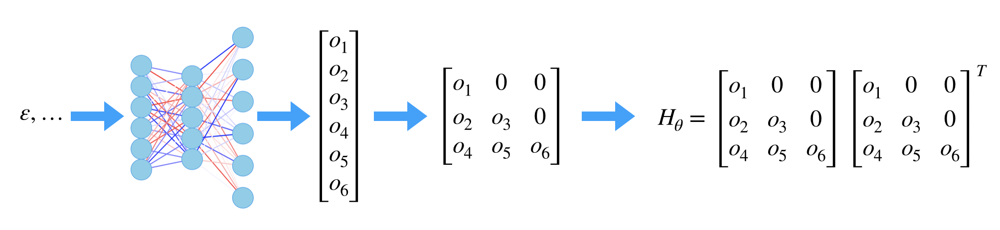

# Problem and Methodology

## Hyper-elasticity

In the hyperelasticity case, the constitutive relation is given by the general form 

$$\sigma = f(\varepsilon) .$$

In our approach, this relation is modeled by 

$$\sigma = H_{\theta}(\varepsilon) (\varepsilon-\varepsilon_0) + \sigma_0, \tag{1}$$

where $\varepsilon_0$ and $\sigma_0$ are strain and stress at the last time step and $H_\theta$  is a neural network with weights and biases $\theta$. $H_{\theta}(\varepsilon)$ is constrained to a SPD matrix, which can be achieved by using a custom layer for the output of the neural network 

$$H_{\theta}(\varepsilon) = LL',\quad L = \begin{bmatrix}
o_1(\varepsilon;\theta) & 0 & 0\\
o_2(\varepsilon;\theta) & o_3(\varepsilon;\theta) & 0\\
o_4(\varepsilon;\theta) & o_5(\varepsilon;\theta) & o_6(\varepsilon;\theta)
\end{bmatrix}.$$

Here $o_i$ are the outputs of a fully connected neural network; in other words, the first part of the neural network takes $\varepsilon$ as input and outputs a 6D vector $\{o_i\}$. 

We choose the form (1) based on the observation that if $\varepsilon=\varepsilon_0$ then we must have $\sigma=\sigma_0$. Additionally, $H_{\theta}(\varepsilon)$ is the tangent matrix of the constitutive relation and that's why we assume SPD for $H_\theta$. 

## Plasticity

In the plasticity case, the constitutive relation is more complicated. In general, the strain is decomposed into the elastic strain and plastic strain

$$\varepsilon = \varepsilon^e + \varepsilon^{p}$$

The constitutive relations for both strains are described by ($\alpha$ is called the  **internal variable**.)

| Strain Component | Constitutive Relation                                        |
| ---------------- | ------------------------------------------------------------ |
| $\varepsilon^e$  | $\sigma = E\varepsilon^e$                                    |
| $\varepsilon^p$  | $$\begin{aligned}\dot \varepsilon^e &= \dot\lambda \frac{\partial f(\sigma, \alpha)}{\partial \sigma} \\\lambda f(\sigma,\alpha) &= 0 \quad f(\sigma,\alpha)\leq 0 \quad \lambda \geq 0 \\\dot\alpha & =  h(\sigma, \alpha)\end{aligned}$$ |

In contract to hyperelasticity, the plasticity constitutive relation is history dependent, i.e., the current tangent matrix does not only depdent on $\varepsilon$ but also $\varepsilon_0$, $\sigma_0$ and $\sigma_0$ (The subscription "0" denotes values at last time step). Additionally, in plasticity, when the strain (or stress) is very small, the material undergoes elasticity; therefore, we expect a certain "elasticity regime". This motivates us to model the plasticity relation by 

$$\sigma = \Big(\eta(\sigma_0)H_0  + (1-\eta(\sigma_0))H_{\theta}(\varepsilon, \varepsilon_0, \sigma_0, \alpha_0)\Big)  (\varepsilon-\varepsilon_0) + \sigma_0,$$

where $\eta(\sigma_0)$ is close to 1 when $\sigma_0$ is small and thus the tangent matrix is approximately $H_0$ (a constant matrix independent of the strain and the stress). In practice, we found that ignoring the internal variable does not affect our results too much and therefore the model we use is 

$$\sigma = \Big(\eta(\sigma_0)H_0  + (1-\eta(\sigma_0))H_{\theta}(\varepsilon, \varepsilon_0, \sigma_0)\Big)  (\varepsilon-\varepsilon_0) + \sigma_0, \tag{2}$$

## Multiscale

The constitutive relation model (2) is also used for the multiscale case, where the material is a mixture of plasticity materials and elasticity materials. 

