# Plasticity

## Training and Testing Set

We generate 10 sets of data for training the neural network (100, 101, 102, 103, 104, 200, 201, 202, 203, 204), 4 sets of data for validating (105, 106, 205, 206) and 1 set of data for testing (300). The setting are as follows (the arrows represents force direction but may indicate different force magnitude; the shaded area indicates fixed sides). 

## Visualization

Here we show the stress and displacements at the corner of the training and testing data.

| ID   | Stress                                  | $u_x$ | $u_y$ |
| ---- | --------------------------------------- | ----- | ----- |
| 100  |  | 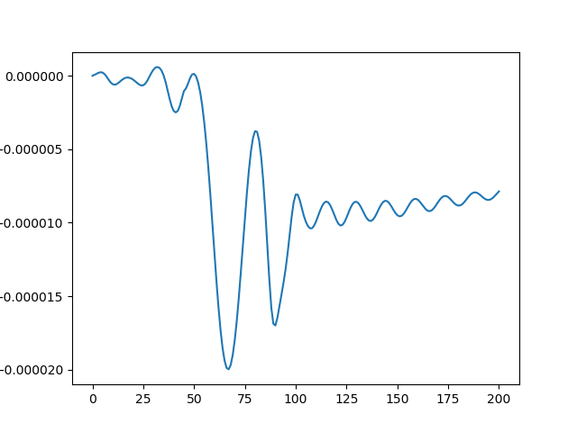      | 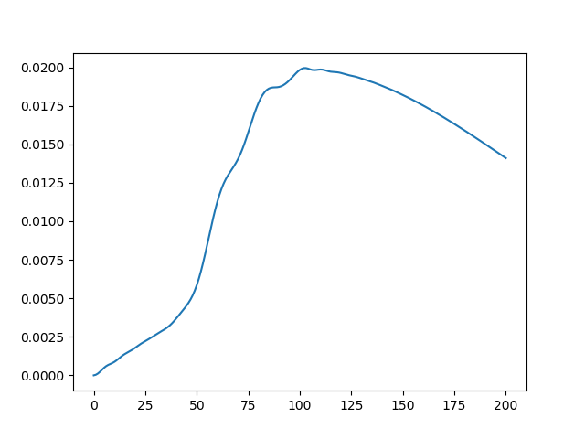      |
| 101  |  | 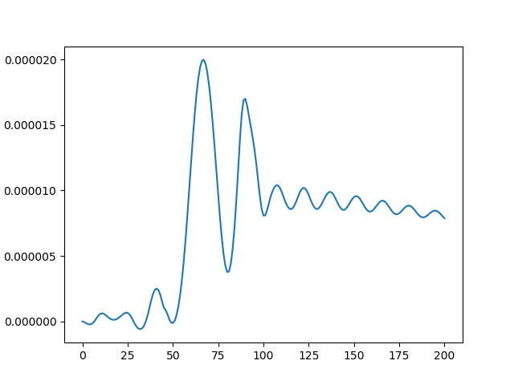      | 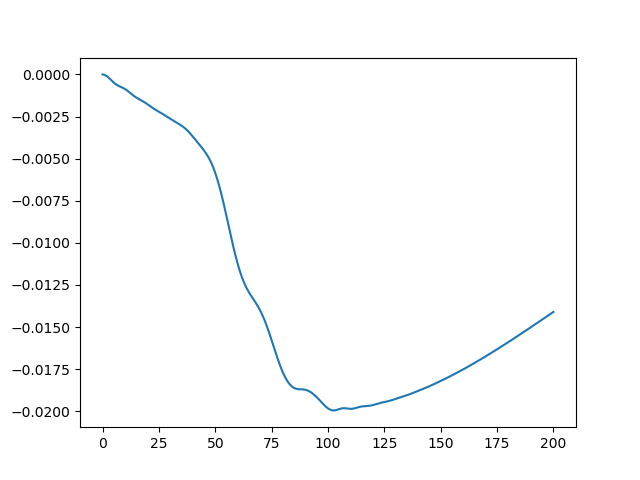      |
| 102  | 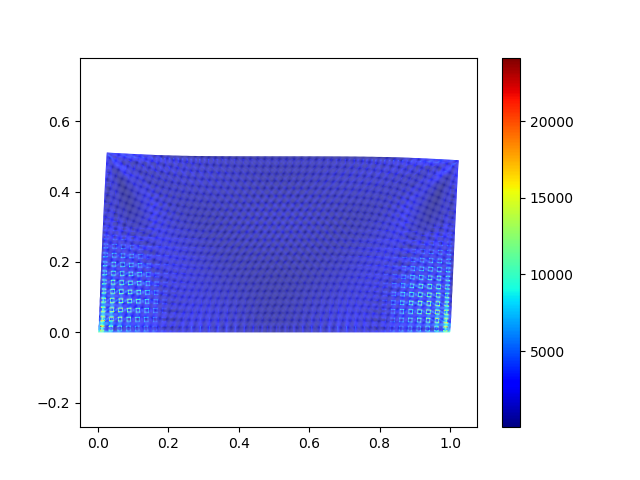 | 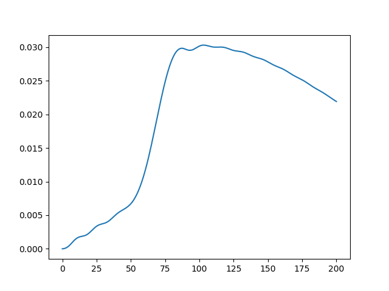      | 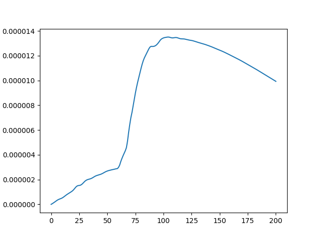      |
| 103  |  | 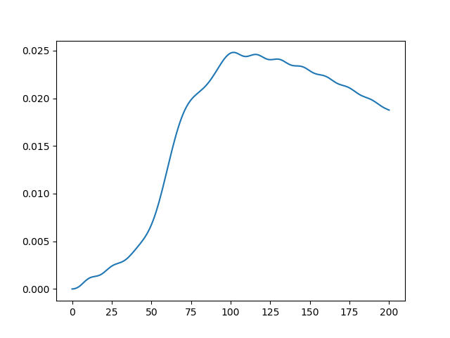      |       |
| 104  |  |       |       |
| 105  |  | 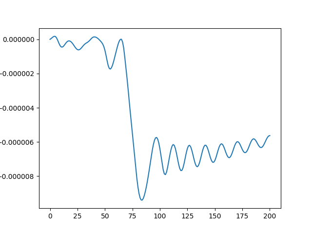      | 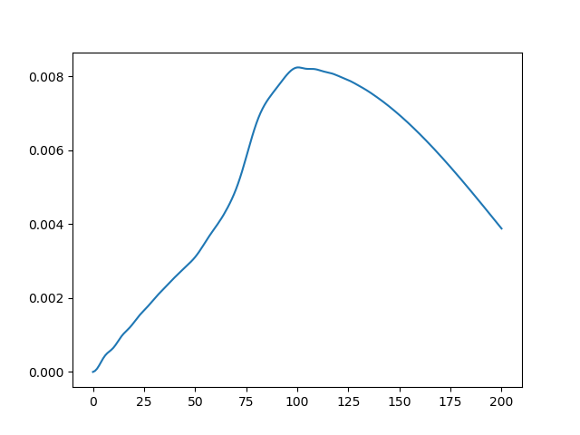      |
| 106  | 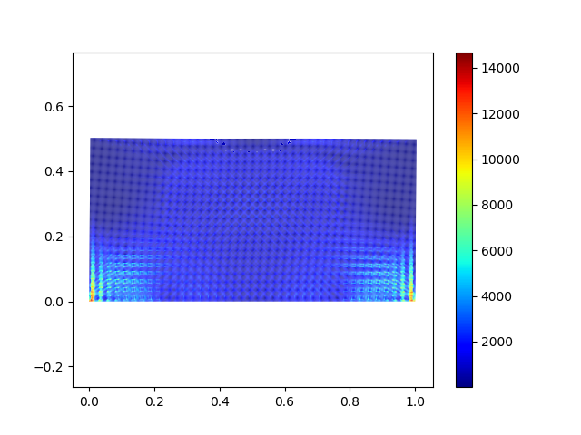 | 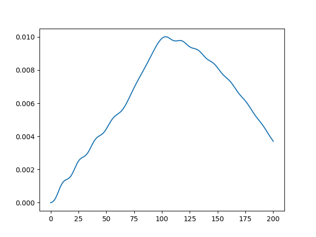      |       |
| 200  | 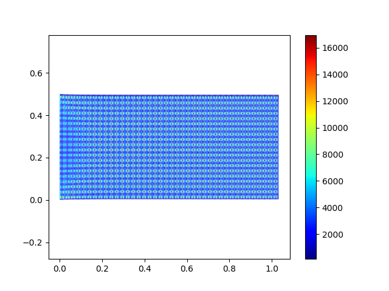 |       | 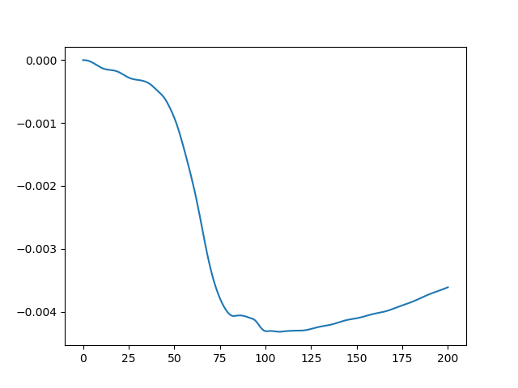      |
| 201  |  | 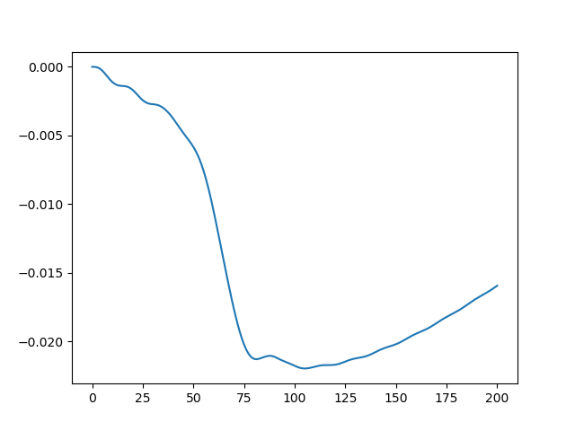      |       |
| 202  |  | 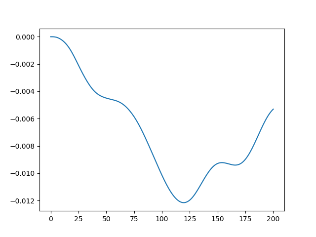      |       |
| 203  | 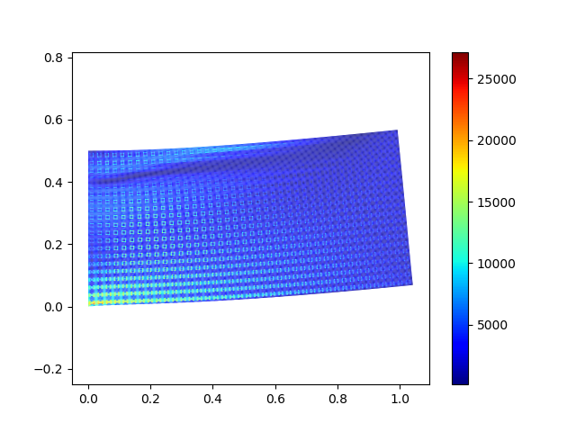 |       | 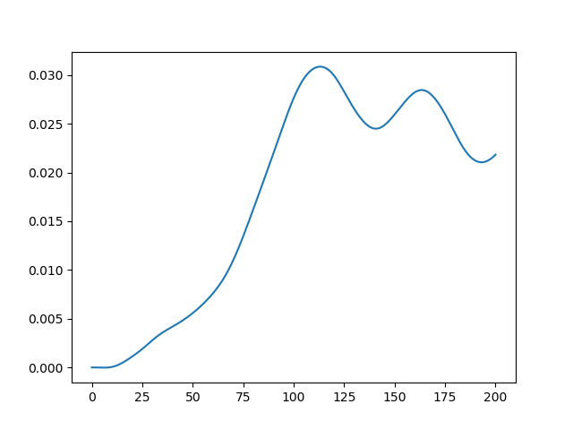      |
| 204  | 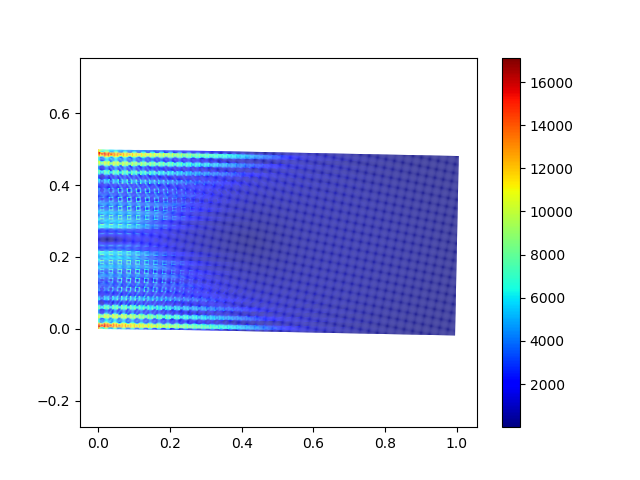 |       | 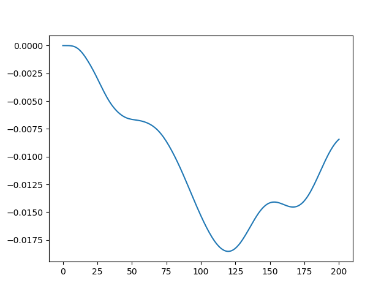      |
| 205  | 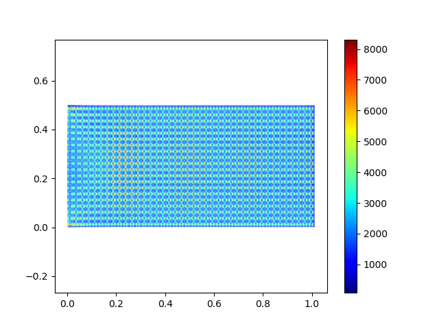 |       | 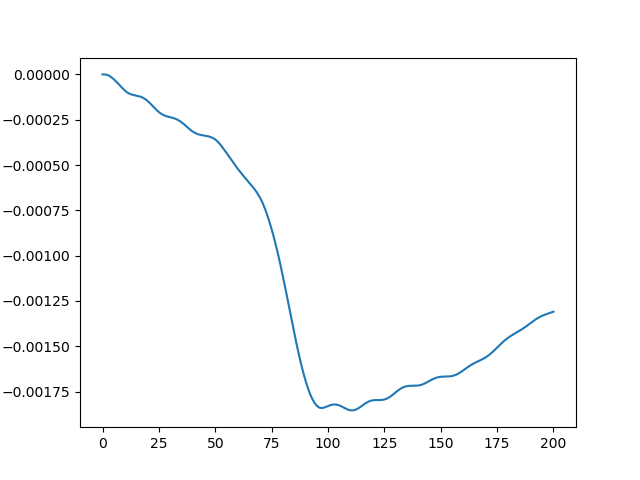      |
| 206  | 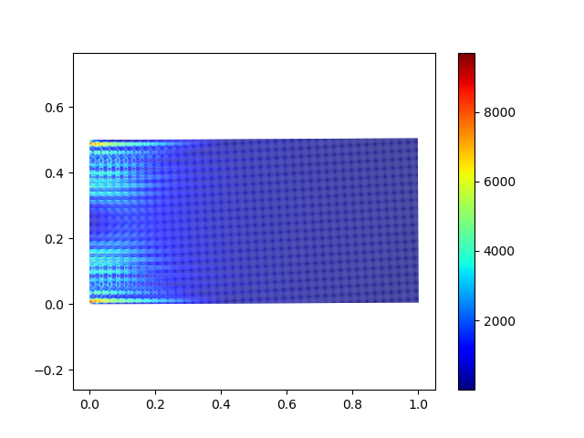 | 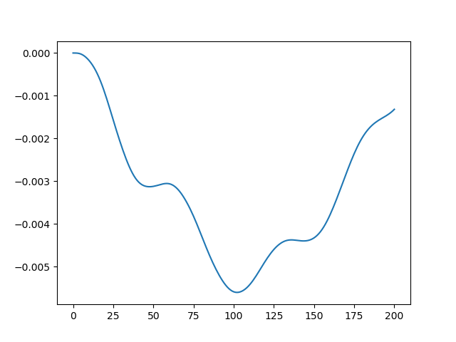      | 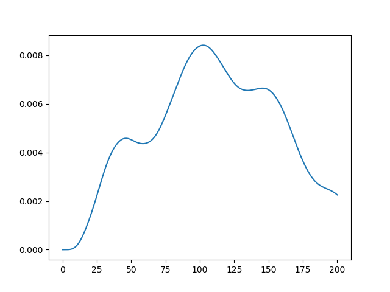      |
| 300  |  | 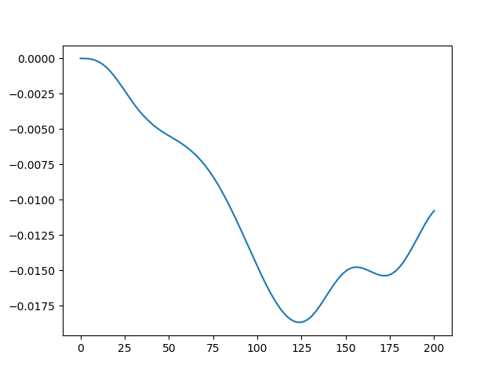      | 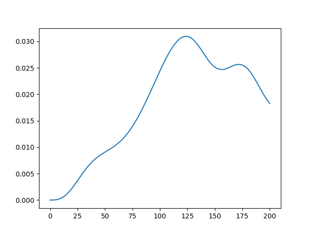      |

