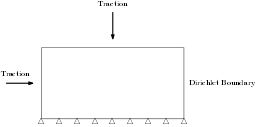

# Dynamic Problems

NNFEM can be used to solve the folowing dynamical problem

$$\ddot u - {\text{div}}\sigma  = f, x\in \Omega \tag{1}$$

where $u$ is the 2D displacement vector, $\sigma$ is the stress, and $f$ is the body force. The dynamical equation is supplemented with two kinds of boundary conditions: Dirichlet boundary conditions and Neumann boundary conditions. For each type of conditions, we consider two types: time-dependent and time-independent. The following matrix shows all possible boundary conditions supported by NNFEM. 

|                  | Dirichlet                              | Neumann                                       |
| ---------------- | -------------------------------------- | --------------------------------------------- |
| Time-independent | $$u(x,t) = u_1(x), x\in \Gamma_D^1$$   | $$\sigma(x,t)n(x) = t_1(x), x\in \Gamma_N^1$$ |
| Time-dependent   | $$u(x,t) = u_2(x,t), x\in \Gamma_D^2$$ | $$\sigma(x,t)n(x) = t_2(x), x\in \Gamma_N^2$$ |

The weak form of Equation 1 can be written as 

$$\int_\Omega u \delta u dx  + \int_\Omega \sigma :\delta \epsilon dx = \int_\Omega f \delta u dx + \int_{\Gamma_N} t \delta u dx \tag{2}$$

Here 

$$\int_{\Gamma_N} t \delta u dx =\int_{\Gamma_N^1} t_1 \delta u dx + \int_{\Gamma_N^2} t_2 \delta u dx $$

In NNFEM, the boundary information are marked in `EBC` and `FBC` arrays in the geometry information `Domain`, respectively. These arrays have size $n_v\times 2$, corresponding to $n_v$ nodes and $x$-/$y$-directions. $-1$ represents time-independent boundaries and $-2$ represents time-dependent boundaries. Time indepdent boundary conditions `g` and `fext` are precomputed and fed to `Domain`, while time independent bounary conditions can be evaluated online with `EBC_func` and `FBC_func` in `GlobalData`. In the case the external load is provided as $t(x,t) = \sigma(x,t)n(x)$, we can use `Edge_func` and `Edge_Traction_Data` to provide the information instead of  `FBC_func`. 

If we express Equation 2 in terms of matrices, we have

$$M \ddot{\mathbf{u}} + K (\mathbf{u}) = \mathbf{f} + \mathbf{t}$$

Here $K(\mathbf{u})$ can be nonlinear. 

There are two solver implemented in NNFEM: the explicit solver and the generalized alpha solver. Both solvers support automatic differentiation for a linear $K$. The explicit solver also supports automatic differentiation for nonlinear $K$. 

To get started, you can study the following examples. Most likely you only need to modify the script to meet your own needs. 

## Settings

In the following examples, we consider the following domain. 



The manufactured is given by 

$$u(x, y, t) = (1-y^2)(x^2+y^2) e^{-t}, v(x, y, t)=(1-y^2)(x^2-y^2)e^{-t}$$

The domain for small strain can be constructed as follows

```julia
using Revise
using NNFEM 
using PyPlot
using ADCME
using LinearAlgebra

NT = 100
Δt = 1.0e-2
T = NT * Δt

m, n =  20, 10
h = 0.1

# Create a very simple mesh
elements = SmallStrainContinuum[]
prop = Dict("name"=> "PlaneStrain", "rho"=> 0.0876584, "E"=>0.07180760098, "nu"=>0.4)
coords = zeros((m+1)*(n+1), 2)
for j = 1:n
    for i = 1:m
        idx = (m+1)*(j-1)+i 
        elnodes = [idx; idx+1; idx+1+m+1; idx+m+1]
        ngp = 3
        nodes = [
            (i-1)*h (j-1)*h
            i*h (j-1)*h
            i*h j*h
            (i-1)*h j*h
        ]
        coords[elnodes, :] = nodes
        push!(elements, SmallStrainContinuum(nodes, elnodes, prop, ngp))
    end
end

Edge_Traction_Data = Array{Int64}[]
for i = 1:m 
  elem = elements[i]
  for k = 1:4
    if elem.coords[k,2]<0.001 && elem.coords[k+1>4 ? 1 : k+1,2]<0.001
      push!(Edge_Traction_Data, [i, k, 0])
    end
  end
end

for i = 1:n
  elem = elements[(i-1)*m+1]
  for k = 1:4
    if elem.coords[k,1]<0.001 && elem.coords[k+1>4 ? 1 : k+1,1]<0.001
      push!(Edge_Traction_Data, [(i-1)*m+1, k, 0])
    end
  end
end

Edge_Traction_Data = hcat(Edge_Traction_Data...)'|>Array

# fixed on the bottom, push on the right
EBC = zeros(Int64, (m+1)*(n+1), 2)
FBC = zeros(Int64, (m+1)*(n+1), 2)
g = zeros((m+1)*(n+1), 2)
f = zeros((m+1)*(n+1), 2)
for j = 1:n
  idx = (j-1)*(m+1) + m+1
	EBC[idx,:] .= -1 # fixed boundary
end
for i = 1:m+1
  idx = n*(m+1) + i 
  EBC[idx,:] .= -2 # fixed boundary 
end
dimension = 2
domain = Domain(coords, elements, dimension, EBC, g, FBC, f, Edge_Traction_Data)

x = domain.nodes[domain.dof_to_eq]
y = domain.nodes[domain.dof_to_eq]
# Set initial condition 
Dstate = zeros(domain.neqs) # d at last step 
state = [(@. (1-y^2)*(x^2+y^2)); (@. (1-y^2)*(x^2+y^2))]
velo = -[(@. (1-y^2)*(x^2+y^2)); (@. (1-y^2)*(x^2+y^2))]
acce = [(@. (1-y^2)*(x^2+y^2)); (@. (1-y^2)*(x^2+y^2))]
gt = nothing
ft = nothing

EBC_DOF = findall(EBC[:,1] .== -2)
x_EBC = domain.nodes[EBC_DOF,1]
y_EBC = domain.nodes[EBC_DOF,2]
function EBC_func(t)
  [(@. (1-y_EBC^2)*(x_EBC^2+y_EBC^2)*exp(-t));
    (@. (1-y_EBC^2)*(x_EBC^2-y_EBC^2)*exp(-t))]
end

FBC_func = nothing 
Body_func = nothing # this needs to be set when known 
Edge_func = nothing
globdat = GlobalData(state, Dstate, velo, acce, domain.neqs, EBC_func, FBC_func, Body_func, 						Edge_func)
```


