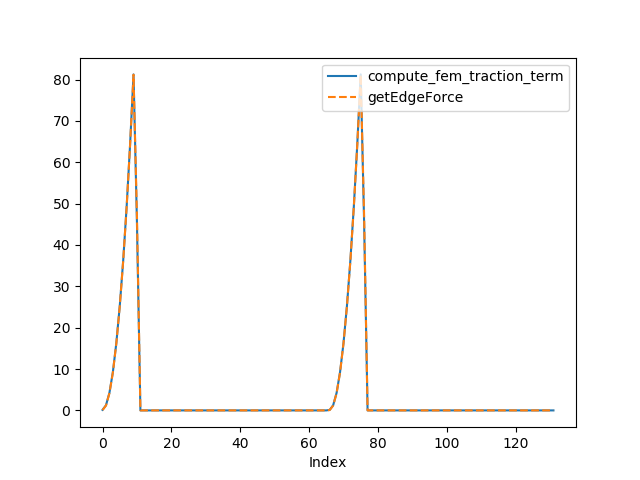

# Helper Functions

There are many helper functions for facilitating forward computation. This note can serve as examples how to use them as well as a way to verify the results. 


## `compute_boundary_info`

This function prepares the boundary information. Only time-dependent displacement and accelration are implemented. 

```julia
ts = ExplicitSolverTime(Δt, NT)
ubd0, abd0 = compute_boundary_info(domain, globaldata, ts)

idx = findall(domain.EBC[:,1].==-2)
x = domain.nodes[idx,1]
y = domain.nodes[idx,2]
for i = 1:NT
    t = ts[i]
    ubd[i,:] = [
        @. (1-y^2)*(x^2+y^2)*0.1*exp(-t)
        @. (1-y^2)*(x^2-y^2)*0.1*exp(-t)
    ]
    abd[i,:] = [
        @. (1-y^2)*(x^2+y^2)*0.1*exp(-t)
        @. (1-y^2)*(x^2-y^2)*0.1*exp(-t)
    ]
end

@show maximum(abs.(ubd0-ubd))
@show maximum(abs.(abd0-abd))
```

## `compute_external_force`

`compute_external_force` returns the external force we need to add to the right hand side of the equation. 

This includes the body force, the edge force, and the force due to acceleration. 

```julia
ts = ExplicitSolverTime(Δt, NT)
fext = compute_external_force(domain, globaldata, ts)

for i = 1:NT
    t = ts[i]
    globaldata.time = t
    Fext[i,:] = getExternalForce(domain, globaldata)
end
@show maximum(abs.(fext-Fext))
```

## `getEdgeForce`

```julia
m = 10
n = 5
h = 1.0
domain = example_domain(m, n, h)
globaldata = example_global_data(domain)
edge_traction_data = zeros(Int64, m, 3)
for i = 1:m 
  edge_traction_data[i,:] = [i;1;0]
end
domain.edge_traction_data = edge_traction_data
function edge_func(x, y, t, idx)
  return [(@. x^2+y^2) (@. x^2-y^2)]
end
globaldata.Edge_func = edge_func
F = getEdgeForce(domain, globaldata, 0.0)
```

To verify the results, we can use `PoreFlow.jl`

```julia
using PoreFlow
bdedge = bcedge("upper", m, n, h)
t = zeros(m, 2)
for i = 1:m
  x = (i-0.5)*h
  y = 0
  t[i,:] = [x^2+y^2;x^2-y^2]
end
v = compute_fem_traction_term(t, bdedge, m, n, h)
```

We can visualize the both force vectors

```julia
plot(v, "-", label="compute_fem_traction_term")
plot(F, "--", label="getEdgeForce")
xlabel("Index")
legend()
```




