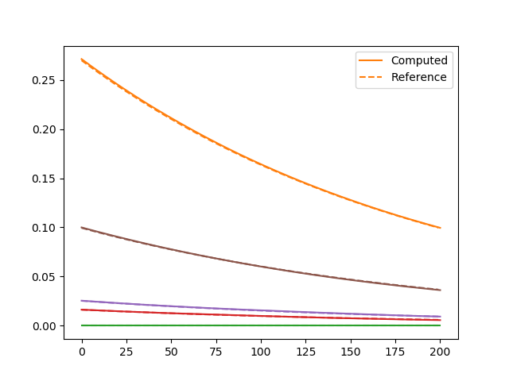

# Linear Elasticity

In this example, we consider the linear elasticity problem. The strain stress relation is given by 

$$\sigma = H \epsilon$$

where the linear elasticity matrix $H$ is given by 

```julia
H = elements[1].mat[1].H
```

The data and geometry settings are from [this section](https://kailaix.github.io/NNFEM.jl/dev/verify/).

## Analytical Solution

We can use `SymPy.jl` to generate the analytical solution

```julia
using SymPy
H = elements[1].mat[1].H
x, y, t = @vars x y t
u = 0.1*(1-y^2)*(x^2+y^2)*exp(-t)
v = 0.1* (1-y^2)*(x^2-y^2)*exp(-t)
ux = diff(u,x)
uy = diff(u,y)
vx = diff(v,x)
vy = diff(v,y)
ϵ = [ux;vy;uy+vx]
σ = H * ϵ
f1 = u - (diff(σ[1], x) + diff(σ[3], y))
f2 = v - (diff(σ[3], x) + diff(σ[2], y))
println(replace(replace(sympy.julia_code(f1), ".*"=>"*"), ".^"=>"^"))
println(replace(replace(sympy.julia_code(f2), ".*"=>"*"), ".^"=>"^"))

S = [σ[1] σ[3]
	σ[3] σ[2]]
# edge function on domain 0
t1 = S * [-1.0;0.0]
# edge function on domain 1
t2 = S * [0;-1.0]

println(replace(replace(sympy.julia_code(t1[1]), ".*"=>"*"), ".^"=>"^"))
println(replace(replace(sympy.julia_code(t1[2]), ".*"=>"*"), ".^"=>"^"))

println(replace(replace(sympy.julia_code(t2[1]), ".*"=>"*"), ".^"=>"^"))
println(replace(replace(sympy.julia_code(t2[2]), ".*"=>"*"), ".^"=>"^"))


```

## Forward Computation

To conduct forward computation using AD-enabled kernels, we need to precompute some data. This includes the boundary conditions and external force

```julia
# linear elasticity matrix at each Gauss point
Hs = zeros(domain.neles*length(domain.elements[1].weights), 3, 3)
for i = 1:size(Hs,1)
    Hs[i,:,:] = elements[1].mat[1].H
end

# Construct Edge_func
function Edge_func_linear_elasticity(x, y, t, idx)
  if idx==0
      f1 = @. -6.41975308641975*x*(0.1 - 0.1*y^2)*exp(-t) + 3.45679012345679*y*(0.1 - 0.1*y^2)*exp(-t) + 0.345679012345679*y*(x^2 - y^2)*exp(-t)
      f2 = @. -1.48148148148148*x*(0.1 - 0.1*y^2)*exp(-t) - 1.48148148148148*y*(0.1 - 0.1*y^2)*exp(-t) + 0.148148148148148*y*(x^2 + y^2)*exp(-t)
    elseif idx==1
      f1 = @. -1.48148148148148*x*(0.1 - 0.1*y^2)*exp(-t) - 1.48148148148148*y*(0.1 - 0.1*y^2)*exp(-t) + 0.148148148148148*y*(x^2 + y^2)*exp(-t)
      f2 = @. -3.45679012345679*x*(0.1 - 0.1*y^2)*exp(-t) + 6.41975308641975*y*(0.1 - 0.1*y^2)*exp(-t) + 0.641975308641975*y*(x^2 - y^2)*exp(-t)
    end
    return [f1 f2] 
end
globaldata.Edge_func = Edge_func_linear_elasticity
  


```

Finally, we can carry out forward computation

```julia
ts = ExplicitSolverTime(Δt, NT)
ubd, abd = compute_boundary_info(domain, globaldata, ts)
Fext = compute_external_force(domain, globaldata, ts) 
d, v, a= ExplicitSolver(globaldata, domain, d0, v0, a0, Δt, NT, Hs, Fext, ubd, abd)

# # NOTE: You can also use the implicit alpha solvers
# ts = GeneralizedAlphaSolverTime(Δt, NT)
# ubd, abd = compute_boundary_info(domain, globaldata, ts)
# Fext = compute_external_force(domain, globaldata, ts) 
# d, v, a= GeneralizedAlphaSolver(globaldata, domain, d0, v0, a0, Δt, NT, Hs, Fext, ubd, abd)

sess = Session(); init(sess)
d_, v_, a_ = run(sess, [d,v,a])
```

The computation can be verified by comparing with exact solutions 

```julia
using Random; Random.seed!(233)
for k = 1:5
    i = rand(1:m+1)
    j = rand(1:n+1)
    if k==1
        plot(d_[:,(j-1)*(m+1)+i], color = "C$k", label="Computed")
    else
        plot(d_[:,(j-1)*(m+1)+i], color = "C$k")
    end
    x0 = (i-1)*h 
    y0 = (j-1)*h

    if k==1
        plot((@. (1-y0^2)*(x0^2+y0^2)*exp(-ts))*0.1 ,"--", color="C$k", label="Reference")
    else
        plot((@. (1-y0^2)*(x0^2+y0^2)*exp(-ts))*0.1 ,"--", color="C$k")
    end
end
legend()
```


| Generalized $\alpha$ Scheme (Implicit) | Explicit Solver        |
| -------------------------------------- | ---------------------- |
|                  |  |

## Calibration 

Now assume that we do not know the Poisson's ratio or Young's modulus. To calibrate them, suppose we can collect data from the top left point. The inversion can be done within just a few lines of codes:

```julia
E = Variable(1.0)
ν = Variable(0.0)
H11 = E*(1. -ν)/((1+ν)*(1. -2. *ν));
H12 = H11*ν/(1-ν);
H21 = H12;
H22 = H11;
H33 = H11*0.5*(1. -2. *ν)/(1. -ν);
H = tensor(
  [H11 H12 0.0
  H21 H22 0.0
  0.0 0.0 H33]
)
d, v, a= ExplicitSolver(globaldata, domain, d0, v0, a0, Δt, NT, H, Fext, ubd, abd)
idx = [1;domain.nnodes+1]
loss = sum((d[:, idx] - d_[:, idx])^2)
sess = Session(); init(sess)
BFGS!(sess, loss, var_to_bounds=Dict(E=>(0.0,100.0), ν=>(-0.5,0.49)))
run(sess, [E, ν])
```

The estimated values are

$$E_{est} = 1.9999999977827019, \nu_{est} = 0.3500000005217777$$

The true values are 

$$E^* = 2.0, \nu^* = 0.35$$